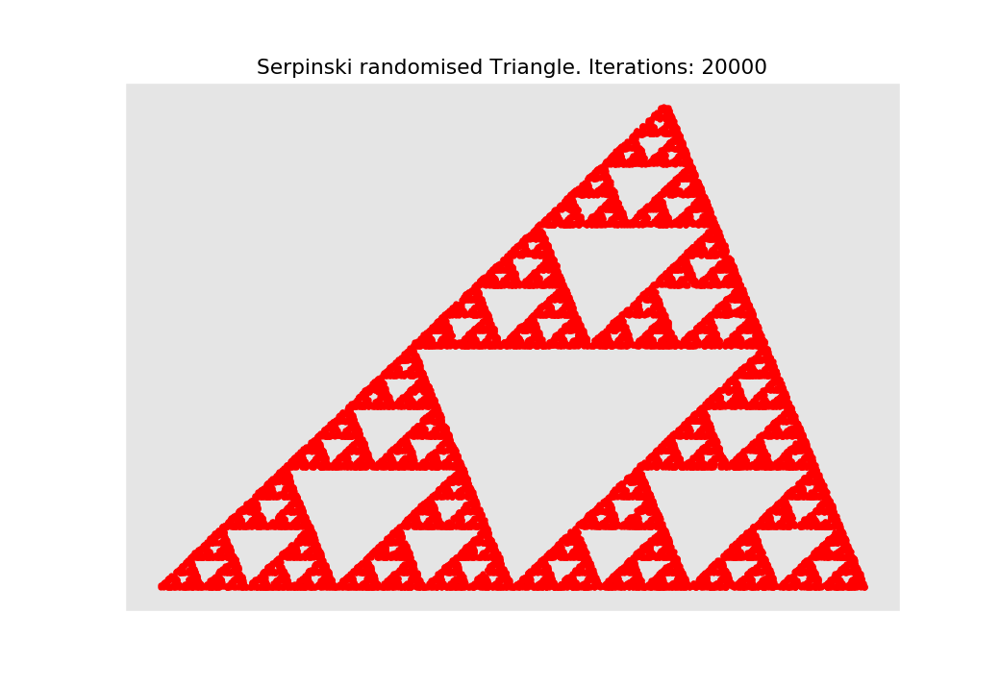
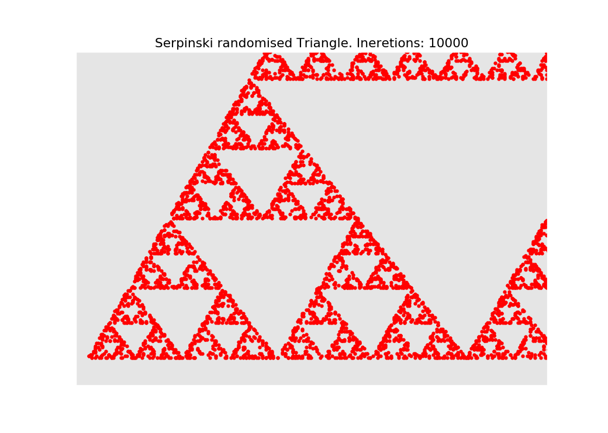
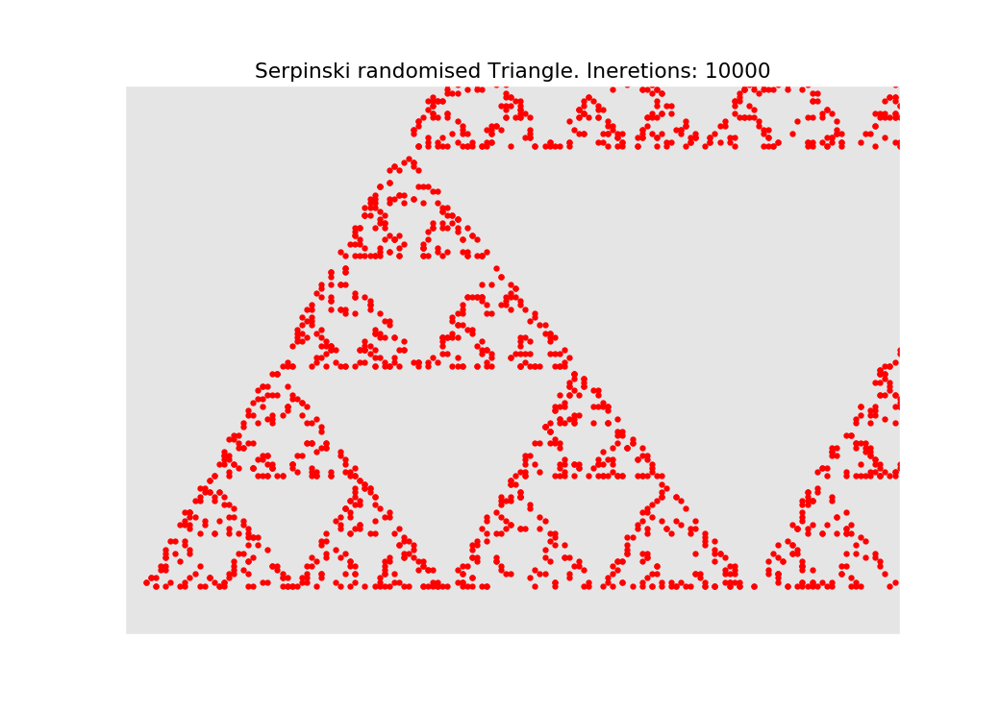

# Fractals
Few experiments with fractals and Python...

## Serpinski Randomised Triangle

You can zoom In and Out of this figure.
For example zoom in:  

And again:

## Requirements:

* Python
* NumPy
* MatPlotLib

## AUTHOR
   An0ther0ne
