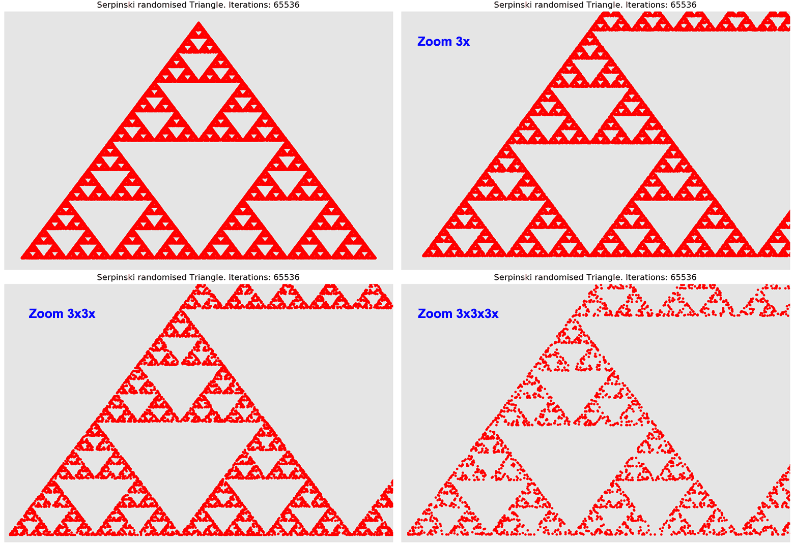

# Fractals
Few experiments with fractals and Python...

## Serpinski Randomised Triangle

You can zoom In and Out of this figure.

### Algorithm

1. Start with equilateral triangle and number its vertices 1,2,3
2. Plot a random dot point
3. Calculate a random integer number in range from 1 to number of triangle vertices (3)
4. Find a middle point from a random point (see para.2) to triangle vertice with number, calculated in para. 3, and plot a new dot point at them.
5. Store coordinates of dot point as new random instead of para 2.
6. Repeat steps 3-5 as many times as you wish. 

## Serpinski Randomised Rectangle

In the next figure shown rectangle, filled with similar chaos algorithm.

## Requirements:

* Python
* NumPy
* MatPlotLib

## AUTHOR
   An0ther0ne
